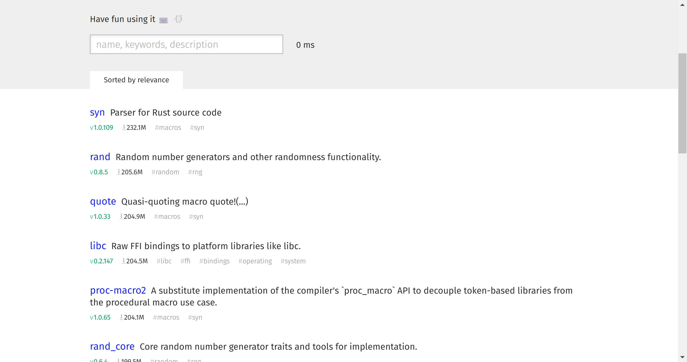
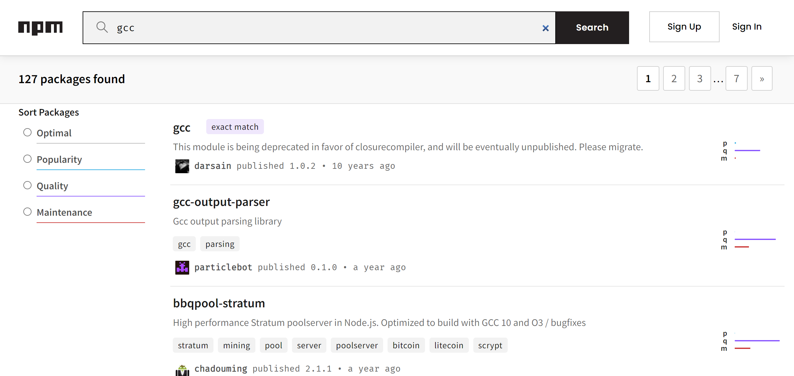
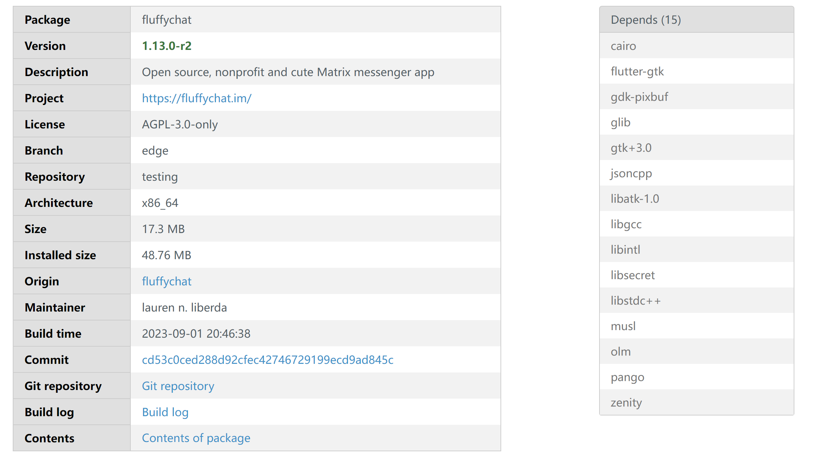

# apk search

## 简介

apk-search 是为 Alpine Linux 建造的“软件包”搜索网站，用户可以在网页中搜寻需要的软件包并查看软件包的详细信息。

## 后端

搜索基于 meilisearch，网站只有这唯一的 API，参考官方文档：https://www.meilisearch.com/docs

### API

API共有两个使用方法：

1. 搜索，预期得到一个json字符串，前端主要是把`hits`展现出来
   
   - https://www.meilisearch.com/docs/learn/getting_started/quick_start#search
   - https://www.meilisearch.com/docs/reference/api/search
   
   ```json
   {
     "hits": [
       {
         "id": 29751,
         "title": "Batman Unmasked: The Psychology of the Dark Knight",
         "poster": "https://image.tmdb.org/t/p/w1280/jjHu128XLARc2k4cJrblAvZe0HE.jpg",
         "overview": "Delve into the world of Batman and the vigilante justice tha",
         "release_date": "2008-07-15"
       },
       {
         "id": 471474,
         "title": "Batman: Gotham by Gaslight",
         "poster": "https://image.tmdb.org/t/p/w1280/7souLi5zqQCnpZVghaXv0Wowi0y.jpg",
         "overview": "ve Victorian Age Gotham City, Batman begins his war on crime",
         "release_date": "2018-01-12"
       },
       …
     ],
     "estimatedTotalHits": 66,
     "query": "botman",
     "limit": 20,
     "offset": 0,
     "processingTimeMs": 12
   }
   
   ```

2. 获取指定 Package 的详细信息（充当kv数据库）
   - https://www.meilisearch.com/docs/reference/api/documents#get-one-document
   
   和上面搜索相同，但是只获取其中的一个结果

### 字段

我们利用官方的软件源镜像索引文件 `APKINDEX.tar.gz` 生成搜索需要的信息（定时同步更新）。其中我们认为以下字段对本服务有效：

|         字段 | 含义         |                             示例                             |
| :--------------- | :------------- | :----------------------------------------------------------- |
|   Package Name | **软件包包名** |                             7zip                             |
|      Version | **版本号**   |                           22.01-r5                           |
|    APK Size | 安装包体积    |                            854251                            |
| Installed Size | 安装后占用 |                           1695744                            |
|         Description | **软件包描述**      |         File archiver with a high compression ratio          |
|         Project URL | 项目网址          |                      https://7-zip.org/                      |
|           License | 协议           |                        LGPL-2.0-only                         |
|            Origin | 母包           |                             7zip                             |
|          Maintainer | 打包人          |            Alex Xu (Hello71) <alex_y_xu@yahoo.ca>            |
|       Build Timestamp | 打包时间       |                          1681951026                          |
|        Aports Commit | 打包 commit        |           1e1218a01323cd9ff429e22ac0f8d62ae9088b78           |
|         Dependencies | 依赖        |      libc.musl-x86_64.so.1 libgcc_s.so.1 libstdc++.so.6      |
|           Provides | 提供          | 7zip-virtual p7zip=22.01-r5 cmd:7z=22.01-r5 cmd:7zz=22.01-r5 |

**母包**：有的软件包是 doc 或者 bash 补全配置文件，例如 7zip-doc 的母包就是 7zip

**提供**：安装此包后能获得什么

- so：动态链接库
- cmd：可执行文件
- pc：pkg-config

## 前端

静态网页+搜索API，共两个页面

### 1. 搜索页面

之前我自己设计的不太好做手机端的页面逻辑，于是还是参考别人家的搜索页面：

- https://crates.meilisearch.com/



- https://www.npmjs.com/search?q=gcc



搜索需要两个过滤器，用户要选择自己的目标平台和版本

1. 架构（x86-64 还是 arm64）
2. 版本（滚动版还是稳定版）

展示在搜索界面的字段有：

- Package Name
- Version & Build Date
- Description
- Provide(when search hits)
- Origin(when be sub-package)

由于我们的软件包没有下载量这一统计数据，因此不需要这一项。由于用户只需要安装使用不存在打包这一过程，因此软件包的协议也可以不在这页显示（放到详情页中？）

点击可以跳转到下面的软件包详情页面

### 2. 软件包详情页面（如果上面做好了的话）

以下是 Alpine Linux 官方的软件包详情页面，相比搜索结果页面展示更多信息（这里还要再考虑）

- https://pkgs.alpinelinux.org/package/edge/testing/x86_64/fluffychat



## 参考

- https://blog.meilisearch.com/search-rust-crates-meili/
- https://github.com/qaqland/apk-search